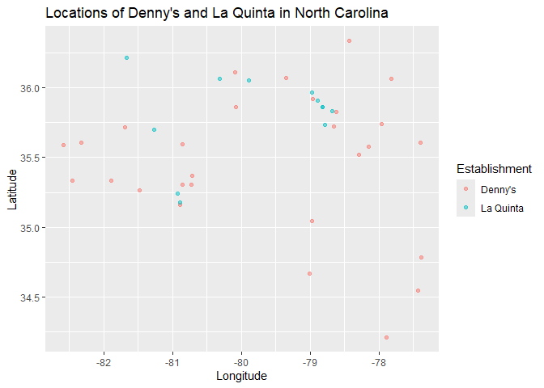
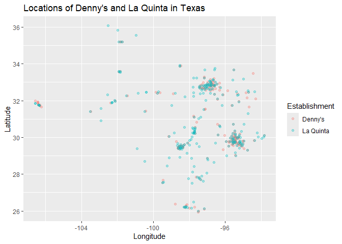

Lab 04 - La Quinta is Spanish for next to Denny’s, Pt. 1
================
Yiwei Tang
2/2/2026

### Load packages and data

``` r
library(tidyverse) 
library(dsbox) 
```

``` r
states <- read_csv("data/states.csv")
```

### Exercise 1

There are 1643 rows and 6 columns of the Denny’s dataset. Each row
represent a observation, while each column represent a variable. The
variables are address, city, state, zip, longitude, and latitude.

``` r
nrow(dennys)
```

    ## [1] 1643

``` r
ncol(dennys)
```

    ## [1] 6

``` r
colnames(dennys)
```

    ## [1] "address"   "city"      "state"     "zip"       "longitude" "latitude"

### Exercise 2

There are 909 rows and 6 columns of the La Quinta’s dataset. Again, each
row represent a observation, aka a store. The variables are the same to
those of the Denny’s dataset.

``` r
dim(laquinta)
```

    ## [1] 909   6

``` r
colnames(laquinta)
```

    ## [1] "address"   "city"      "state"     "zip"       "longitude" "latitude"

### Exercise 3

There are La Quinta’s outside of the US, in countries like Canada,
Mexico, China, New Zealand, Georgia, Turkiye, United Arab Emirates,
Colombia, and Ecuador. Denny’s doesn’t have locations outside of the US.

### Exercise 4

I can look at the states to identify the locations that are not in US
states. Or, by comparing the longitude and latitude of the location to
the boarder of the US territory, I can identify locations that are
outside the US.

### Exercise 5

There aren’t any Denny’s locations outside the US.

``` r
dennys %>% 
  filter(!(state %in% states$abbreviation))
```

    ## # A tibble: 0 × 6
    ## # ℹ 6 variables: address <chr>, city <chr>, state <chr>, zip <chr>,
    ## #   longitude <dbl>, latitude <dbl>

### Exercise 6

``` r
dn <- dennys %>% 
  mutate(country = "United States")
```

### Exercise 7

``` r
laquinta %>% 
  filter(!(state %in% states$abbreviation)) %>% 
  View()
```

### Exercise 8

``` r
lq <- laquinta %>% 
  mutate(country = case_when(
    state %in% states$abbreviation ~ "United States", 
    state %in% c("ON", "BC") ~ "Canada", 
    state == "ANT" ~ "Colombia", 
    state %in% c("AG", "QR", "CH", "NL", "VE", "PU", "SL") ~ "Mexico", 
    state == "FM" ~ "Honduras"
  ))

lq <- lq %>% 
  filter(country == "United States")
```

### Exercise 9

California has the most Denny’s locations.

``` r
dn %>% 
  count(state, sort = TRUE)
```

    ## # A tibble: 51 × 2
    ##    state     n
    ##    <chr> <int>
    ##  1 CA      403
    ##  2 TX      200
    ##  3 FL      140
    ##  4 AZ       83
    ##  5 IL       56
    ##  6 NY       56
    ##  7 WA       49
    ##  8 OH       44
    ##  9 MO       42
    ## 10 PA       40
    ## # ℹ 41 more rows

Alaska has the fewest Denny’s locations.

``` r
dn %>% 
  count(state, sort = FALSE)
```

    ## # A tibble: 51 × 2
    ##    state     n
    ##    <chr> <int>
    ##  1 AK        3
    ##  2 AL        7
    ##  3 AR        9
    ##  4 AZ       83
    ##  5 CA      403
    ##  6 CO       29
    ##  7 CT       12
    ##  8 DC        2
    ##  9 DE        1
    ## 10 FL      140
    ## # ℹ 41 more rows

Texas has the most La Quinta’s locations.

``` r
lq %>% 
  count(state, sort = TRUE)
```

    ## # A tibble: 48 × 2
    ##    state     n
    ##    <chr> <int>
    ##  1 TX      237
    ##  2 FL       74
    ##  3 CA       56
    ##  4 GA       41
    ##  5 TN       30
    ##  6 OK       29
    ##  7 LA       28
    ##  8 CO       27
    ##  9 NM       19
    ## 10 NY       19
    ## # ℹ 38 more rows

Alaska has the fewest Denny’s locations.

``` r
lq %>% 
  count(state, sort = FALSE)
```

    ## # A tibble: 48 × 2
    ##    state     n
    ##    <chr> <int>
    ##  1 AK        2
    ##  2 AL       16
    ##  3 AR       13
    ##  4 AZ       18
    ##  5 CA       56
    ##  6 CO       27
    ##  7 CT        6
    ##  8 FL       74
    ##  9 GA       41
    ## 10 IA        4
    ## # ℹ 38 more rows

This is not really surprising, since Denny’s was founded in California.
La Quinta is Hispanic and Texas has a large Hispanic population. Both
businesses have the fewest locations in Alaska, which is also not
surprising, since Alaska has sparse population.

### Exercise 10

Washington DC has the most Denny’s locations per thousand square miles.

``` r
dn %>% 
  count(state) %>% 
  inner_join(states, by = c("state" = "abbreviation")) %>% 
  mutate(density = area / n) %>% 
  arrange(density)
```

    ## # A tibble: 51 × 5
    ##    state     n name                     area density
    ##    <chr> <int> <chr>                   <dbl>   <dbl>
    ##  1 DC        2 District of Columbia     68.3    34.2
    ##  2 RI        5 Rhode Island           1545.    309. 
    ##  3 CA      403 California           163695.    406. 
    ##  4 CT       12 Connecticut            5543.    462. 
    ##  5 FL      140 Florida               65758.    470. 
    ##  6 MD       26 Maryland              12406.    477. 
    ##  7 NJ       10 New Jersey             8723.    872. 
    ##  8 NY       56 New York              54555.    974. 
    ##  9 IN       37 Indiana               36420.    984. 
    ## 10 OH       44 Ohio                  44826.   1019. 
    ## # ℹ 41 more rows

Rhode Island has the most La Quinta locations per thousand square miles.

``` r
lq %>% 
  count(state) %>% 
  inner_join(states, by = c("state" = "abbreviation")) %>% 
  mutate(density = area / n) %>% 
  arrange(density)
```

    ## # A tibble: 48 × 5
    ##    state     n name             area density
    ##    <chr> <int> <chr>           <dbl>   <dbl>
    ##  1 RI        2 Rhode Island    1545.    772.
    ##  2 FL       74 Florida        65758.    889.
    ##  3 CT        6 Connecticut     5543.    924.
    ##  4 MD       13 Maryland       12406.    954.
    ##  5 TX      237 Texas         268596.   1133.
    ##  6 TN       30 Tennessee      42144.   1405.
    ##  7 GA       41 Georgia        59425.   1449.
    ##  8 NJ        5 New Jersey      8723.   1745.
    ##  9 MA        6 Massachusetts  10554.   1759.
    ## 10 LA       28 Louisiana      52378.   1871.
    ## # ℹ 38 more rows

### Exercise 11

Visually, Mitch Hedberg’s joke doesn’t appear to hold in North Carolina.

``` r
dn <- dn %>%
  mutate(establishment = "Denny's")
lq <- lq %>%
  mutate(establishment = "La Quinta")
dn_lq <- bind_rows(dn, lq)

dn_lq %>% 
  filter(state == "NC") %>% 
  ggplot(mapping = aes(
    x = longitude,
    y = latitude,
    color = establishment
)) +
  geom_point(alpha = 0.5) +
  labs(x = "Longitude",
       y = "Latitude",
       color = "Establishment",
       title = "Locations of Denny's and La Quinta in North Carolina")
```

<!-- -->

### Exercise 12

Mitch Hedberg’s joke appears to hold in Taxes, as the locations of the
two establishments are highly overlapped.

``` r
dn <- dn %>%
  mutate(establishment = "Denny's")
lq <- lq %>%
  mutate(establishment = "La Quinta")
dn_lq <- bind_rows(dn, lq)

dn_lq %>% 
  filter(state == "TX") %>% 
  ggplot(mapping = aes(
    x = longitude,
    y = latitude,
    color = establishment
)) +
  geom_point(alpha = 0.3) +
  labs(x = "Longitude",
       y = "Latitude",
       color = "Establishment",
       title = "Locations of Denny's and La Quinta in Texas")
```

<!-- -->
